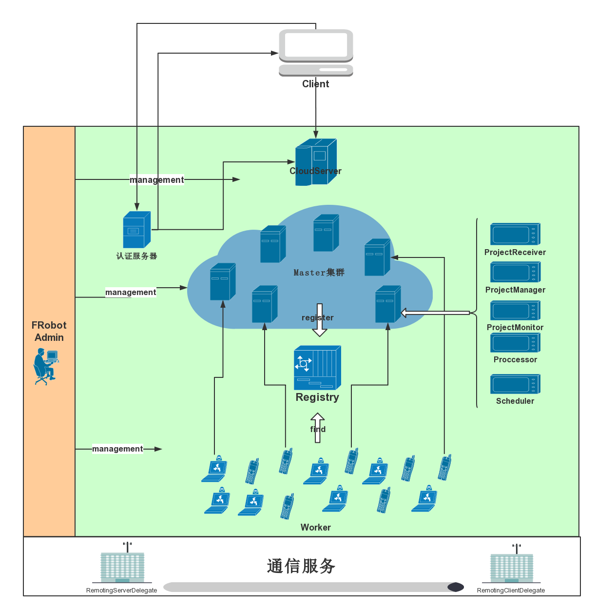

# Frobot Cloud Platform
这是一个分布式云平台框架，该框架主要面向于轻量级的分布式任务调度，分布式系统中总共分为如下四个角色:

- **cloud server**: 用户交互接口，并将用户提交的任务推送给可用的master节点。
- **master**: 分布式任务调度中的调度者，将用户提交的任务进行分解并建立相应的子任务流程图，依据相应算法进行任务调度和分配。
- **worker**: 任务执行者，接受master传送过来的任务，然后执行结果。
- **registry**: 地址注册中心，记录可用的master地址，并按照负载均衡算法将worker分配给指定的master。

##系统架构

